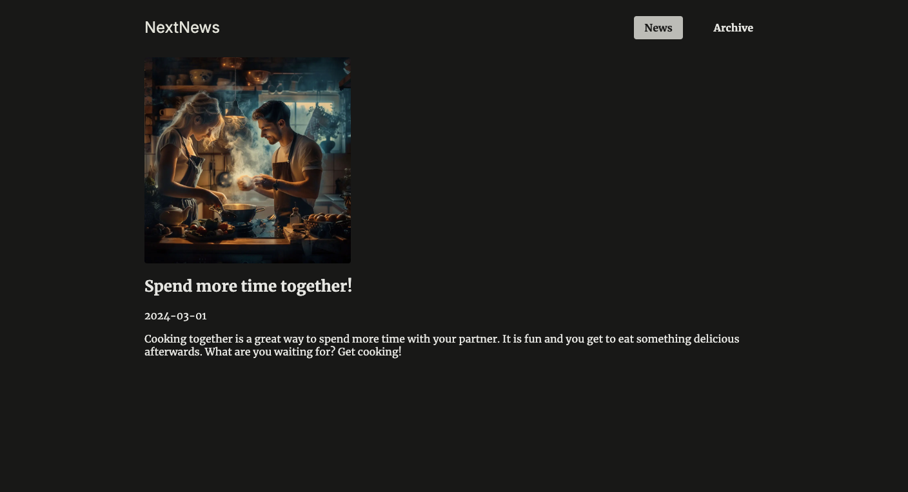

# Next Routing

A comprehensive demonstration of Next.js 15's **advanced routing capabilities** and patterns based on [Maximilian Schwarzmüller's Udemy course](https://www.udemy.com/course/react-the-complete-guide-incl-redux).

## Next Routing Demo

### Route Groups

- Content Routes (`(content)`)
  - `/news` - Main news listing
  - `/archive` - News archive
- Landing Routes (`(landing)`)
  - `/` - Homepage

### Parallel Routes

- Archive Page with Parallel Routes
  - `@archive` - Filter component
  - `@latest` - Latest news section
    Example: `/archive/2024/3`

### Intercepting Routes

- Modal Image View
  - `(.)/image` - Intercepts full image view
    Example: `/news/hiking/image`

### Dynamic Routes

- News Detail Pages
  - `/news/[slug]` - Individual news articles
    Example: `/news/will-ai-replace-humans`

### Catch-all Routes

- Archive Filter
  - `/archive/[[...filter]]` - Handles year/month filtering
    Example: `/archive/2024` or `/archive/2024/3`

### Special Files

- `layout.tsx` - Shared layouts
- `not-found.tsx` - Custom 404 pages
- `error.tsx` - Error boundaries
- `default.tsx` - Default UI for parallel routes

## Screenshots

Home Page

Archive Page

News Page

News Details Page

